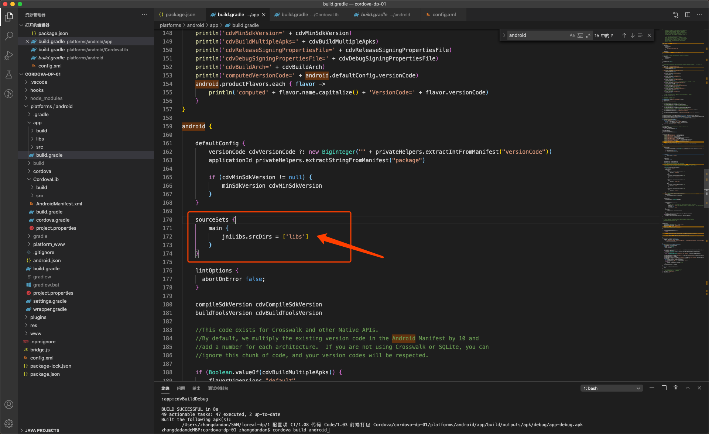

# DP在线插件引用

1、创建一个新的`cordova`项目：
`cordova create cordova-dp`

2、添加插件`test_plugin`，目前插件在本机地址：`/Users/zhangdandan/SVN/loreal-dp/1 配置项 CI/1.08 代码 Code/1.03 前端打包 Cordova/plugin/Test`

3、获取`定位`需要把百度的lib包加入到项目中，即将`libs`文件夹拷贝至 `cordova-dp/platforms/android/app`目录下。libs文件目前在本机地址：`/Users/zhangdandan/SVN/loreal-dp/1\ 配置项\ CI/1.08\ 代码\ Code/1.03\ 前端打包\ Cordova/libs`,并且在`cordova-dp/platforms/android/app/build.bradle`文件中添加几行代码：
```java
android {
    .....
    sourceSets {
        main {
            jniLibs.srcDirs = ['libs']
        }
    }
    .....
}
```

如图所示：




4、在`www/项目html`中需要引入 `bridge.js`