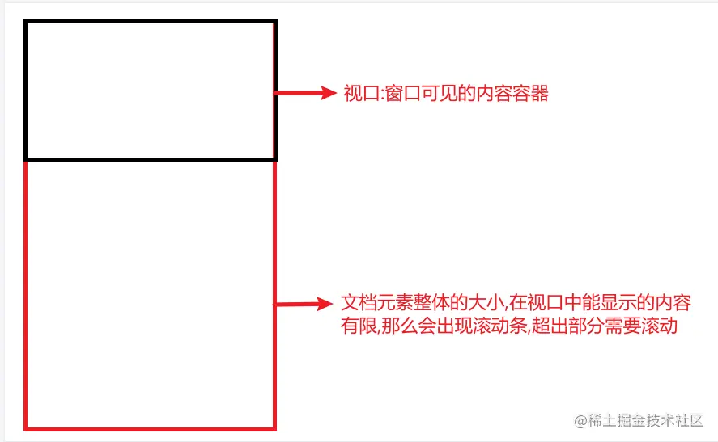
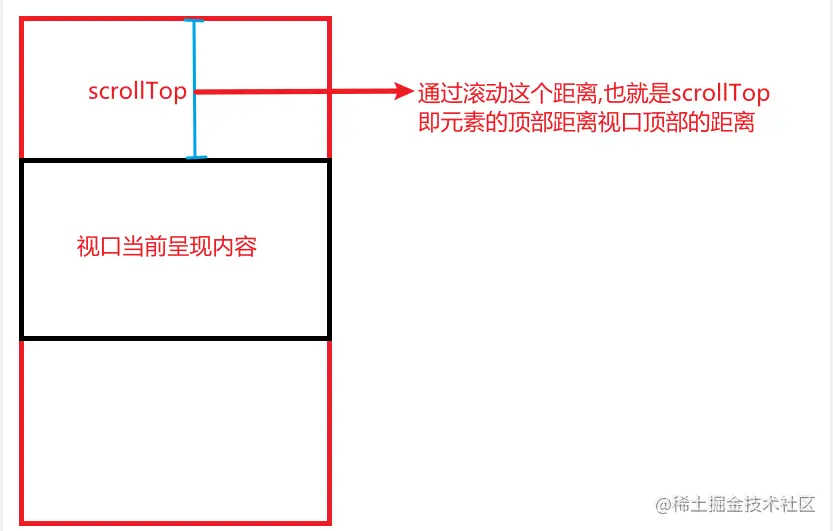
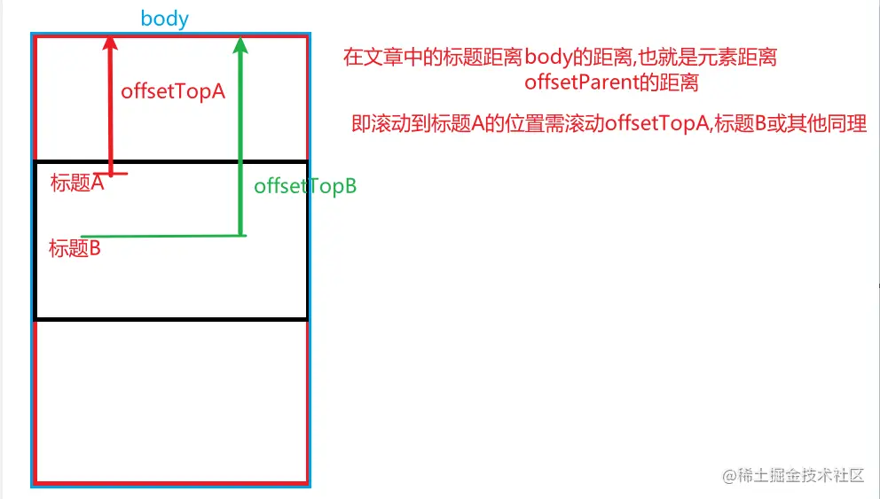

# 锚点跳转

## 传统方式
在 `vue` 项目中使用传统的锚点跳转方式会跳转至新界面，例如：

```html
<a href="#title_01">跳转</a>

....

<ul>
    <li id="title_01">01<li>
    <li id="title_02">02<li>
    <li id="title_03">03<li>
    <li id="title_04">04<li>
    <li id="title_05">05<li>  
<ul>
```
点击 `跳转` 浏览器地址将会变成 `http://XXXXX.html#/title_01`,所以我们需要利滚动监听事件来实现 `锚点` 功能。


## 两个属性: scrollTop 和 offsetTop

它可以获取或设置一个元素的内容垂直滚动的像素数 [MDN 官方文档](https://developer.mozilla.org/zh-CN/docs/Web/API/Element/scrollTop) 、[掘金文章参考](https://juejin.cn/post/7037389069407485959)

> 定义:一个元素的 `scrollTop` 值是这个元素的内容顶部（卷起来的）到它的视口可见内容（的顶部）的距离的度量。当一个元素的内容没有产生垂直方向的滚动条，那么它的 `scrollTop` 值为`0`。

通过画图来了解下这个属性 首先是视口和元素



那么 `scrollTop` 就是


再者就是 `offsetTop` 它返回当前元素相对于其 `offsetParent` 元素的顶部内边距的距离 [MDN 官方文档](https://developer.mozilla.org/zh-CN/docs/Web/API/HTMLElement/offsetTop)


## 监听方式

首先计算每个模块距离滚动盒子的高度
```html
<div ref="schemaRef">XXXX</div>
<div ref="schemaRef">XXXX</div>
<div ref="schemaRef">XXXX</div>
<div ref="schemaRef">XXXX</div>
<div ref="schemaRef">XXXX</div>
```
```js
...
formMounted() {
    setTimeout(() => {
        this.offDistance = []
        this.offsetTops = []
        this.$refs.schemaRef.forEach(item => {
            this.offsetTops.push(item.offsetTop)
            this.offDistance.push(item.offsetTop + item.offsetHeight - 20)
        })
    }, 200)
},
...
```
增加滚动盒子的监听事件
```js
// 滚动盒子滚动监听，判断选中标签
this.$refs.RenderContaierRef.addEventListener('scroll', e => {
    for(let i = 0 ; i < this.offDistance.length ; i++) {
        if(e.target.scrollTop < this.offDistance[i] ) {
            this.activeIndex = i
            break
        }
    }
})
```

如果需要快速跳转至某个盒子的话，增加点击事件：
```html
<div @click="skip(0)">标题一</div>
<div @click="skip(1)">标题二</div>
```
```js
skip(index) {
    this.activeIndex = index
    this.$refs.RenderContaierRef.scrollTop = this.offsetTops[index]
}
```