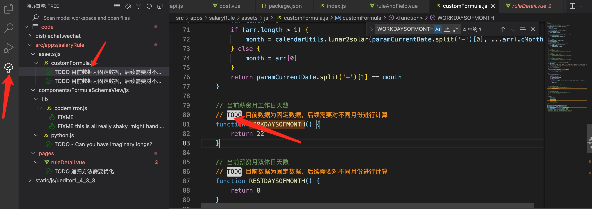

# 前端开发规范

## 代码规范

- [代码规范]()
    - [命名规则](page/codeGuide/rule.md)
    - [HTML](page/codeGuide/html.md)
    - [CSS,SCSS](page/codeGuide/css.md)
    - [JavaScript](page/codeGuide/javascript.md)
- [Eslint](page/codeGuide/eslint.md)

## vscode工具

### todo-tree

在vscode 中使用 `TODO` 来标记未完成的功能

```
// TODO 目前数据为固定数据，后续需要对不同月份进行计算
function WORKDAYSOFMONTH() {
    return 22
}
```

