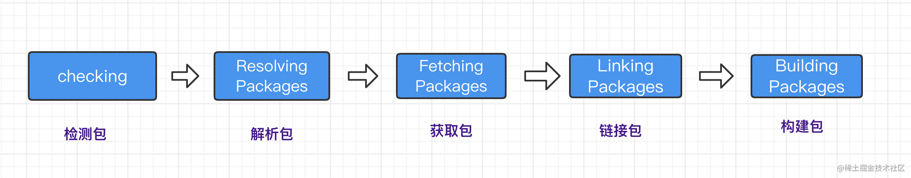
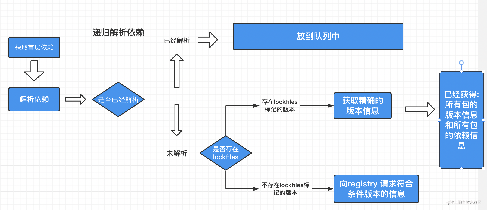
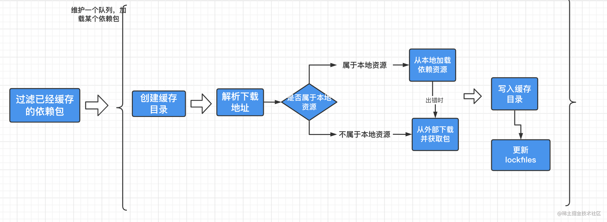
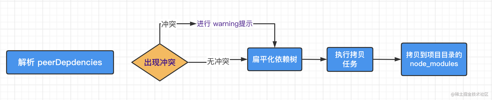
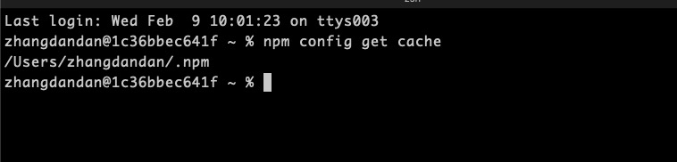
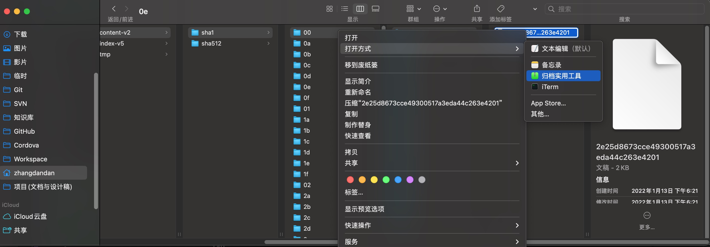

# npm 和 yarn

## npm的安装机制和核心原理

我们可以先来看看 npm 的核心目标

```text
Bring the best of open source to you, your team and your company.
```

意思是 给你和你的团队、你的公司带来最好的开源库和依赖。 通过这句话,我们可以了解到 npm 最重要的一点就是安装和维护依赖。那么，让我们先来看一看npm的安装机制是怎样的呢？

## npm的安装机制

下面我们会通过一个流程图来具体学习`npm install`的安装机制


`npm install`执行之后, 首先会检查和获取 `npm的配置`,这里的优先级为:

`项目级的.npmrc文件` > `用户级的 .npmrc文件` > `全局级的 .npmrc` > `npm内置的 .npmrc 文件`

然后检查项目中是否有 `package-lock.json`文件

* 如果有, 检查 `package-lock.json`和 `package.json`声明的依赖是否一致：
    * 一致, 直接使用`package-lock.json`中的信息,从网络或者缓存中加载依赖
    * 不一致, 根据上述流程中的不同版本进行处理
* 如果没有, 那么会根据`package.json`递归构建依赖树,然后就会根据构建好的依赖去下载完整的依赖资源,在下载的时候,会检查有没有相关的资源缓存:
    * 存在, 直接解压到`node_modules`文件中
    * 不存在, 从npm远端仓库下载包,校验包的完整性,同时添加到缓存中,解压到 `node_modules`中

最后, 生成 `package-lock.json` 文件

其实, 在我们实际的项目开发中，使用npm作为团队的最佳实践: `同一个项目团队,应该保持npm 版本的一致性`。


## yarn的出现

`yarn` 是一个由`Facebook`、`Google`、`Exponent`和`Tilde`构建的新的JavaScript包管理器。它的出现是为了解决历史上`npm`的某些不足(比如npm对于依赖的完整性和一致性的保证,以及npm安装过程中速度很慢的问题)

当npm还处于`v3`时期的时候,一个叫`yarn`的包管理工具横空出世.在2016年, npm还没有`package-lock.json`文件,安装的时候速度很慢,稳定性很差,yarn的出现很好的解决了一下的一些问题:

* `确定性`: 通过yarn.lock等机制,即使是不同的安装顺序,相同的依赖关系在任何的环境和容器中,都可以以相同的方式安装。(那么,此时的npm v5之前,并没有package-lock.json机制,只有默认并不会使用 npm-shrinkwrap.json)
* `采用模块扁平化的安装模式`: 将不同版本的依赖包,按照一定的策略，归结为单个版本;以避免创建多个版本造成工程的冗余(目前版本的npm也有相同的优化)
* `网络性能更好`: yarn采用了请求排队的理念,类似于并发池连接,能够更好的利用网络资源;同时也引入了一种安装失败的重试机制
* `采用缓存机制`,实现了离线模式 (目前的npm也有类似的实现)

我们可以来看一下 `yarn.lock`的结构:

```
"@babel/cli@^7.1.6", "@babel/cli@^7.5.5":
  version "7.8.4"
  resolved "http://npm.in.zhihu.com/@babel%2fcli/-/cli-7.8.4.tgz#505fb053721a98777b2b175323ea4f090b7d3c1c"
  integrity sha1-UF+wU3IamHd7KxdTI+pPCQt9PBw=
  dependencies:
    commander "^4.0.1"
    convert-source-map "^1.1.0"
    fs-readdir-recursive "^1.1.0"
    glob "^7.0.0"
    lodash "^4.17.13"
    make-dir "^2.1.0"
    slash "^2.0.0"
    source-map "^0.5.0"
  optionalDependencies:
    chokidar "^2.1.8"

```

熟悉npm的`package-lock.json`文件的朋友,可能一眼就看到了一些不同; `package-lock.json`采用的是`JSON`的结构,而`yarn`并没有采用这种结构,而是一种自定义的标记方式;我们可以看出新的自定义的方式,也同样保持了高度的可读性。

`相比于npm,Yarn另一个显著的区别就是yarn.lock的子依赖的版本不是固定的版本`。这其实就说明了一个问题: 一个单独的`yarn.lock`的问题并不能确定✅`node-modules`的文件结构,还需要`package.json`的配合。

其实到了这里,我会有一个问题,如何实现 `npm 到 yarn 的切换呢`？

yarn默认采用的是`perfer-online`模式,即优先使用网络资源。如果网络资源请求失败,再去请求缓存数据。


## yarn的安装机制

Yarn的安装大致分为5个步骤:



检测(`checking`) ---> 解析包(`Resolving Packages`) ---> 获取包(`Fetching`) ---> 链接包(`Linking Packages`) ---> 构建包(`Building Packages`)

#### 检测包

这一步，最主要的目的就是检测我们的项目中是否存在npm相关的文件,比如`package-lock.json`等;如果有,就会有相关的提示用户注意：这些文件可能会存在冲突。在这一步骤中 也会检测系统OS, CPU等信息。


#### 解析包

这一步会解析依赖树中的每一个包的信息:
首先呢,获取到`首层依赖`: 也就是我们当前所处的项目中的`package.json`定义的`dependencies`、`devDependencies`、`optionalDependencies`的内容。
紧接着会采用遍历首层依赖的方式来获取包的依赖信息,以及递归查找每个依赖下嵌套依赖的版本信息，并将解析过的包和正在进行解析包呢`用Set数据结构进行存储`,这样就可以保证`同一版本范围内的包`不会进行重复的解析:

兴趣个例子：

1 对于没有解析过的包A, 首次尝试从 yarn.lock中获取版本信息,并且标记为已解析;

2 如果在yarn.lock中没有找到包A， 则向Registry发起请求获取满足版本范围内的已知的最高版本的包信息,获取之后将该包标记为已解析。

总之，经过解析包这一步之后呢,我们就已经确定了解析包的具体版本信息和包的下载地址。



#### 获取包

这一步首先我们会检查缓存中是否有当前依赖的包,同时呢将缓存中不存在的包下载到缓存的目录中。但是这里有一个小问题需要大家思考一下:

比如: 如何去判断缓存中有当前的依赖包呢？

**其实呢,在Yarn中会根据 cacheFolder+slug+node_modules+pkg.name 生成一个路径;判断系统中是否存在该path,如果存在证明已经有缓存,不用重新下载。这个path也就是依赖包缓存的具体路径。**

那么对于没有命中的缓存包呢？在 Yarn 中存在一个Fetch队列,按照具体的规则进行网络请求。如果下载的包是一个file协议,或者是相对路径,就说明指向一个本地目录,此时会调用Fetch From Local从离线缓存中获取包;否则调用 Fetch From External 获取包,最终获取的结果使用 fs.createWriteStream 写入到缓存目录。



#### 链接包

我们上一步已经把依赖放到了缓存目录,那么下一步,我们应该要做什么事情呢？是不是应该把项目中的依赖复制到`node_modules`目录下呢,没错;只不过此时需要遵循一个扁平化的原则。复制依赖之前, Yarn会先解析 `peerDepdencies`，如果找不到符合要求的`peerDepdencies`的包,会有 `warning`提示，并最终拷贝依赖到项目中。



#### 构建包

如果依赖包中存在二进制包需要进行编译，那么会在这一步进行。


## npm的缓存机制

我们看来一下 **npm的对于同一个版本的依赖包是如何进行本地化缓存的**

这是npm查看本地缓存的命令:
```
npm config get cache
```



从图中我们可以看出npm配置缓存的位置在 `/Users/zhangdandan/.npm`（mac os 的默认的缓存的位置）当中。

其实你也看到了`_cacache`的目录的文件:

其中, `content-v2`里面存放的是一些二进制的文件。为了使二进制的文件可读,我把文件做了压缩和解压缩处理。



然后把下面的文件进行解压处理就可以得到我们想要的npm的具体的资源:

这里推荐一个 `the unarchiver` 解压缩工具,支持更多的格式,强力推荐。

而在 `index-v5`文件中呢, 我们使用和刚才一样的操作可以得到一些描述性的文件。

事实上这些内容就是 `content-v2 `文件的索引。

**那么这里我也有一个问题这里的缓存是如何存储并且被利用的呢？**

这里就要提一下 `npm install`的安装机制, 当 npm 执行的时候,通过 `pacote` 把相应的包解压到对应的 `node_modules`下面。(这里顺嘴提一句 pacote感兴趣的可以来一起研究一下细节,我目前有点不太能看懂; 大概的思路是结合网络请求和文件读写配置进行本地的缓存写入和生成对应的压缩文件,这里通过对[一位大佬文章学习](https://juejin.cn/post/6844903785018425351#heading-4)有所得)

npm主要有会有三个地方用到 `pacote`:

* 当你执行 npm install xxx (这时候会通过 `pacote.extract` 把对应的包解压到对应的`node_modules` 下面, `pacote`源码地址: [extract.js](https://github.com/zkat/pacote/blob/latest/extract.js#L19))
* 当你执行 npm cache add xxx (这时候会通过 `pacote.tarball 下的 tarballStream`往我们之前看到的 `_cacache`文件下去添加缓存, pacote源码地址: [tarballStream](https://github.com/npm/pacote/blob/2ddf67f7c4e084ffec315f94e30bb24f944403e3/lib/fetcher.js#L292)）
* 当你执行 npm pack xxx 通过 `pacote.tarball下的 _toFile` 在当前路径生成对应的压缩文件, 源码地址:[_toFile](https://github.com/npm/pacote/blob/2ddf67f7c4e084ffec315f94e30bb24f944403e3/lib/fetcher.js#L383) )

当`npm`下载依赖的时候, 先下载到缓存当中,再解压到我们的项目的 `node_modules中`。
其实 `pacote`是依赖 npm-registry-fetch来下载包, `npm-registry-fetch` 可以通过设置 cache 字段进行相关的缓存工作。

紧接着呢, 我们在每次去安装资源的时候,会根据`package-lock.json`中的

* integrity
* verison
* name

integrity、verison、name 相关信息会生成一个唯一的key;这个key 就能够对应上 index-v5 目录下的缓存记录; 如果发现有缓存资源,就会去找到 tar 包对应的hash值.
根据 `hash`再去找缓存中的`tar`包,然后再次通过 pacote将二进制文件解压缩进我们项目的 `node_modules`目录中，这样就省去了资源下载的网络开销。


**这里需要注意的是, 这里的缓存策略是在 npm v5开始的,那么在 v5之前呢, 每个缓存模块是在我们之前提到的 ~./npmrc 文件中以模块名的格式直接存储的**

存储的格式:`{cache}{name}{version}`。

## 参考资料

<a href="https://link.juejin.cn?target=https%3A%2F%2Fyarn.bootcss.com%2F" target="_blank" rel="nofollow noopener noreferrer" title="https://yarn.bootcss.com/" ref="nofollow noopener noreferrer">yarn官网</a>

<a href="https://link.juejin.cn?target=https%3A%2F%2Fdocs.npmjs.com%2Fabout-npm" target="_blank" rel="nofollow noopener noreferrer" title="https://docs.npmjs.com/about-npm" ref="nofollow noopener noreferrer">npm-about</a>

<a href="https://link.juejin.cn?target=https%3A%2F%2Fkaiwu.lagou.com%2Fcourse%2FcourseInfo.htm%3FcourseId%3D584%23%2Fdetail%2Fpc%3Fid%3D5905" target="_blank" rel="nofollow noopener noreferrer" title="https://kaiwu.lagou.com/course/courseInfo.htm?courseId=584#/detail/pc?id=5905" ref="nofollow noopener noreferrer">前端基础建设与架构 30 讲</a>

<a href="https://link.juejin.cn?target=https%3A%2F%2Fcloud.tencent.com%2Fdeveloper%2Farticle%2F1555982" target="_blank" rel="nofollow noopener noreferrer" title="https://cloud.tencent.com/developer/article/1555982" ref="nofollow noopener noreferrer">npm install 原理分析</a>

<a href="https://link.juejin.cn?target=https%3A%2F%2Fwxsm.space%2F2021%2Fnpm-history%2F" target="_blank" rel="nofollow noopener noreferrer" title="https://wxsm.space/2021/npm-history/" ref="nofollow noopener noreferrer">Node.js 包管理器发展史</a>

<a href="https://link.juejin.cn?target=https%3A%2F%2Fblog.csdn.net%2Fweixin_43459866%2Farticle%2Fdetails%2F112392975" target="_blank" rel="nofollow noopener noreferrer" title="https://blog.csdn.net/weixin_43459866/article/details/112392975" ref="nofollow noopener noreferrer">dependencies devDependencies peerDependencies三者的区别</a>

<a href="https://link.juejin.cn?target=https%3A%2F%2Fsegmentfault.com%2Fa%2F1190000022435060" target="_blank" rel="nofollow noopener noreferrer" title="https://segmentfault.com/a/1190000022435060" ref="nofollow noopener noreferrer">一文搞懂peerDependencies</a>

<a href="https://link.juejin.cn?target=https%3A%2F%2Fsegmentfault.com%2Fa%2F1190000017075256" target="_blank" rel="nofollow noopener noreferrer" title="https://segmentfault.com/a/1190000017075256" ref="nofollow noopener noreferrer">package-lock.json和yarn.lock的包依赖区别</a>

<a href="https://link.juejin.cn?target=https%3A%2F%2Fsegmentfault.com%2Fa%2F1190000009709213" target="_blank" rel="nofollow noopener noreferrer" title="https://segmentfault.com/a/1190000009709213" ref="nofollow noopener noreferrer">npm 和 yarn 缓存策略对比</a>

<a href="https://link.juejin.cn?target=https%3A%2F%2Fzhuanlan.zhihu.com%2Fp%2F128625669" target="_blank" rel="nofollow noopener noreferrer" title="https://zhuanlan.zhihu.com/p/128625669" ref="nofollow noopener noreferrer">作为前端工程师你真的知道 npm install 原理么？</a>

<a href="https://juejin.cn/post/6844903785018425351" target="_blank" title="https://juejin.cn/post/6844903785018425351"># 记一次排错经历——npm缓存浅析</a>


## 

文章链接：https://juejin.cn/post/7060844948316225572