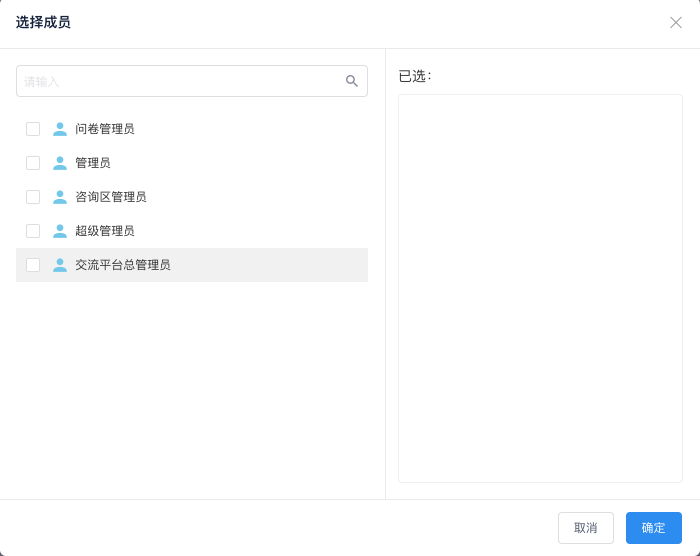

# 流程引擎选人功能

组件地址 : `https://github.com/xtaymydmyd/lxComponents` ， 可下载后加入到项目中；

#### 功能 （单选及多选）
- 选择人员
- 选择部门
- 选择角色、群组、岗位
- 主管

``` html
<select-component ref="selectComponent" @on-submit="submit" @on-cancel="cancel"></select-component>

<button @click="openSelect">全部</button>
```

``` js

import selectComponent from 'lechatComponent/components/selector/select.vue'

export default {
    name: 'index',
    components:{
        selectComponent,
    },
    mounted() {
        
        this.$refs.selectComponent.open(config);
    },
    methods: {
        openSelect(){
            var config = {
                deptId : ['ee8efbe2bfbb437d9a8da1f6d12bdcfc'],
                condition : ['org'],
                type : 2, // 1 ：默认 ,选人、选部门、角色列表、主管（配合condition） ； 2 : 只选人
                chargeLevel : 10,
                title : '选择成员',
                muliteChoice : 2 ,//1 : 多选 2 : 单选
                data : [
                    {
                        "label": "第2级主管",
                        "id": "charge1",
                        "type": 6
                    },
                    {
                        "label": "销售部",
                        "id": "0568d964858f4a2ebbf3767f2c356503",
                        "type": 1
                    }
                ]
            }
            this.$refs.selectComponent.open(config);
        },
        submit(result){
            console.log(result)
        },
        cancel(result){
            console.log(result)
        }
    },
}
 

```

参数： 

| 属性 | 说明 | 类型 | 默认值 |
| ------ | ------ | ------ | ------ |
| title | 弹出框标题 | String | '选择成员' |
| deptId | 根节点id | String | 必填 |
| condition | 表示插件提供‘组织结构’（'org'）、‘角色’(role)、‘主管’(charge) | Array | 必填 : [ 'org' , 'role' , 'charge'] |
| type | 1: 选择人、部门、角色、岗位、群组及主管，配合condition使用 ； 2 ：表示选人 | Number | 1 |
| chargeLevel | 主管等级 | Number | 10 |
| muliteChoice | 1 : 多选 2 : 单选 | Number | 1(多选) |
| data | 默认已选人员 | Array | [] |


## 效果图

### 效果图一：
``` js
    var config = {
        deptId : ['ee8efbe2bfbb437d9a8da1f6d12bdcfc'],
        condition : ['org'],
        type : 2, // 1 ：默认 ,选人、选部门、角色列表、主管（配合condition） ； 2 : 只选人
        chargeLevel : 10,
        title : '选择成员',
        muliteChoice : 2 ,//1 : 多选 2 : 单选
        data : []
    }
```


### 效果图二： 
``` js
    var config = {
        deptId : ['ee8efbe2bfbb437d9a8da1f6d12bdcfc'],
        condition : ['role'],
        type : 2, 
        chargeLevel : 10,
        title : '选择成员',
        muliteChoice : 2 ,
        data : []
    }
```



### 效果图三： 
``` js
    var config = {
        deptId : ['ee8efbe2bfbb437d9a8da1f6d12bdcfc'],
        condition : ['charge'],
        type : 2, 
        chargeLevel : 10,
        title : '选择成员',
        muliteChoice : 2 ,
        data : []
    }
```


### 效果图四： 
``` js
    var config = {
        deptId : ['ee8efbe2bfbb437d9a8da1f6d12bdcfc'],
        condition : ['org','role','charge'],
        type : 2, 
        chargeLevel : 10,
        title : '选择成员',
        muliteChoice : 2 ,
        data : []
    }
```
